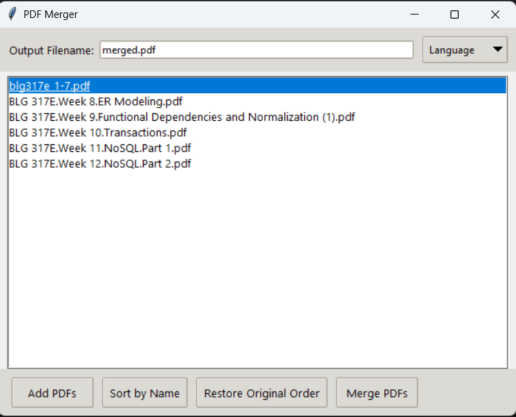

# PDF Merger (English & Turkish)

A modern, lightweight Python application that lets you merge PDF files with drag-and-drop reordering, filename input, and multilingual support (English and Turkish). Built with `tkinter` and `pypdf`.

---

## Features

- Add multiple PDF files
- Easy sorting and ordering.
- Set a custom output file name (default: `merged.pdf`)
- Multilingual interface (English / Türkçe)
- Remembers your language preference across sessions
---

## App Preview


---

## Requirements

- Python 3.8 or higher
- Required Python packages:

```bash
pip install -r requirements.txt
```
---

## Run the App (Developer Mode)

```bash
python app.py
```

---

## Build the `.exe` (for Windows)

Use **PyInstaller** to convert your script into a standalone Windows app.

```bash
pyinstaller --onefile --windowed --icon=myicon.ico merger.py
```

- `--onefile`: single `.exe` output
- `--windowed`: no console window
- `--icon`: set a custom icon (`.ico` format only)

The final app will be in the `dist/` folder.

---

## Troubleshooting

### Missing DLL on older PCs:
If you get an error like:
```
api-ms-win-core-path-1-1-0.dll is missing
```

Install the [Microsoft Visual C++ Redistributable](https://learn.microsoft.com/en-us/cpp/windows/latest-supported-vc-redist) (vc_redist.x64.exe).

You can also try building with PyInstaller version 4.10 for better compatibility:
```bash
pip install pyinstaller==4.10
```
---

## Settings & Language Persistence

- Language choice is saved to `settings.json` in the same folder as the `.exe` or `.py`.
- You can switch between English and Turkish from the app menu.
- Next time you launch the app, it will remember your selected language.

---

## Türkçe Açıklama

PDF dosyalarınızı kolayca birleştirin. Sürükleyip bırakın, sıralayın, isim verin ve çıktı alın. Uygulama İngilizce ve Türkçe dil desteğiyle gelir. Dil tercihiniz kaydedilir ve bir sonraki açılışta otomatik olarak uygulanır.

### Özellikler:

- PDF dosyalarını ekle
- Sürükleyerek sıralamayı değiştir
- İsme göre sırala veya eklenme sırasına dön
- Çıktı dosya adını belirle
- Dil seçeneği (Türkçe / İngilizce)
- Ayarlar `settings.json` dosyasında saklanır

---

## License

You may use and modify this project freely, unless stated otherwise in the future.

---